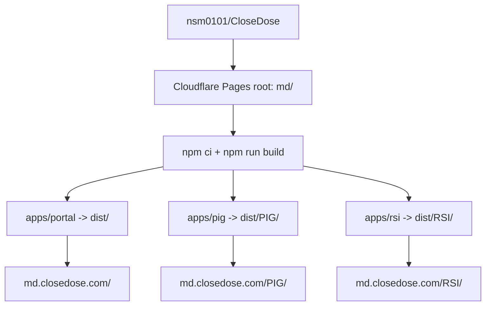

# CloseDose MD Provider Platform Architecture

**Status:** Implemented; provider-suite expansion under clinical review on 2026-07-29

**Production hostname:** `md.closedose.com`

**Initial routes:**

- `https://md.closedose.com/` - provider tool landing page
- `https://md.closedose.com/PIG/` - Pediatric Airway Reference Calculator
- `https://md.closedose.com/RSI/` - Pediatric RSI Medication Calculator
- `https://md.closedose.com/AIRWAY-SCENARIOS/` - Pediatric Airway Scenario Guide
- `https://md.closedose.com/POST-INTUBATION/` - Post-Intubation Sedation Reference
- `https://md.closedose.com/RSI-TIMELINE/` - RSI Progression Timeline
- `https://md.closedose.com/AIRWAY-TRANSPORT/` - Pediatric Airway Transport Kit
- `https://md.closedose.com/PMD/` - PREtendingMD PEM FlowMaster
- `https://md.closedose.com/DEVICE/` - Peds Device Rescue after approval
- `https://md.closedose.com/SEDATION/` - Pediatric Comfort and Sedation after approval

Requests to every available no-slash application route permanently redirect to its
trailing-slash canonical routes. Route casing is intentional and must remain
uppercase.

## PREtendingMD extension

The original architecture below records the first PIG/RSI release. RSI now
uses a byte-pinned shared clinical package rendered through five independent
documents with local state and a common provider shell. The
PREtendingMD migration extends the same workspace and deployment pattern:

- `md/apps/pmd/` is the fourth isolated application workspace and builds to
  `md/dist/PMD/`.
- The root build runs portal, PIG, RSI, and PREtendingMD and requires all four
  entry documents before release.
- The portal describes data handling per tool. PIG and RSI remain local-only.
  PREtendingMD intentionally uses Firebase Authentication, Firestore real-time
  sync, and browser storage for workflow settings.
- The shared CSP keeps scripts and fonts local while allowlisting only the
  exact Firebase Authentication, token, Firestore, and Auth-frame origins
  required by PREtendingMD.
- The migrated build removes Google Analytics and unused AI/server scaffolding.
- The former `closedose.com/PMD/` document redirects to
  `md.closedose.com/PMD/` and preserves its query string and fragment.

Where the historical sections below refer to two tools, three entry documents,
or a fully local-only platform, this extension is the governing architecture.

## Provider-suite clinical release extension

Device Rescue and Pediatric Comfort and Sedation are independent Vite
workspaces with their own calculation or guidance tests and clinical and
implementation specifications. A checked-in manifest is the production
release switch. Production omits an unapproved route document; review mode
builds the document with an unmistakable not-approved status. The provider
catalog may describe review and planned work without implying availability.

The manifest cannot approve itself. Device requires named PEM, pediatric
airway specialty, institutional, and regulatory review. Sedation also requires
named pediatric pharmacy and pediatric sedation or anesthesia review. Every
approval record includes a date and reviewed scope.

The later `/TRANSFER/`, `/AGITATION/`, `/NEWBORN/`, `/CHD/`, `/INGESTION/`, and
`/CLOCK/` routes remain catalog metadata and governance specifications only.
They do not produce HTML entry documents.

## Decision

Build CloseDose MD as a dedicated static provider platform inside the existing `nsm0101/CloseDose` repository under `md/`, but deploy it as a separate Cloudflare Pages project from the current consumer-facing `closedose.com` site.

The first release is a deployment consolidation, not a clinical-logic rewrite. The PIG and RSI applications keep separate source and runtime boundaries while sharing one build pipeline, one provider landing page, one hostname, and one release gate. A later release can extract reviewed, tested clinical rules into shared packages and present both workflows through one unified interface without breaking the original `/PIG/` and `/RSI/` URLs.

## Why this boundary

- A separate Pages project prevents provider releases from changing the existing `closedose.com` deployment.
- One `md/` source root makes preview deployments, production deployment, and future code sharing deterministic.
- One static output avoids a reverse proxy or hostname-aware Worker for the first release.
- Keeping the applications separate during the host migration reduces the chance that a visual or routing change alters clinical calculations.
- Preserving `/PIG/` and `/RSI/` gives durable bookmarks even after the tools are later combined.

## Current source state

The source applications are private GitHub repositories and should be imported at pinned commits before being changed:

| Tool | Repository | Initial import commit | Current deployment readiness |
|---|---|---:|---|
| PIG primary | `nsm0101/PIG-CAR` | `ef67724eccc4e0cfb8b291871147fdd22b9fa811` | Requires repair: `index.html` references `src/main.tsx`, but that file is absent; React and Lucide are also absent from `package.json` |
| PIG alternate | `nsm0101/PIGCAR` | `c02d529d63d69798d081178b5537913392304541` | Has the same incomplete scaffold; its only source difference is a compact equipment-card rendering block in `src/App.tsx` |
| RSI | `nsm0101/CC-RSI` | `a309bdaa7b7736051753a852b274b295ae00c67d` | Complete Vite/React tree; requires a `/RSI/` Vite base and removal of unused AI Studio/server dependencies |

The pinned commit IDs must be recorded in `md/sources.json` so every production build can be traced to the source snapshot used for the import.

### PIG repository comparison

`PIGCAR` was checked as an alternate source. Its `README.md`, `index.html`, `metadata.json`, `package.json`, `tsconfig.json`, and `vite.config.ts` are byte-for-byte identical to `PIG-CAR`. Neither repository contains the referenced `src/main.tsx`, React/Lucide dependencies, or Tailwind build setup.

The only difference is `src/App.tsx` lines 1175–1326 in `PIGCAR`, corresponding to lines 1175–1336 in `PIG-CAR`. The alternate makes airway-equipment cards shorter and denser, but it replaces the displayed ETT backup/target/larger sizing array with a single “0.5 smaller” backup value. Because that changes clinically relevant displayed information, the initial hosting release retains `PIG-CAR` as its primary snapshot. Adopting the alternate presentation requires a separate visual and clinical review.

## Target repository layout

```text
CloseDose/
├── public/                         # Existing closedose.com deployment; unchanged by this project
├── md/
│   ├── package.json                # npm workspaces and composite build commands
│   ├── package-lock.json           # Reproducible dependency graph
│   ├── sources.json                # Original repository and commit provenance
│   ├── README.md                   # Local development and release boundaries
│   ├── DEPLOYMENT.md               # Cloudflare Pages setup and rollback runbook
│   ├── apps/
│   │   ├── portal/                 # md.closedose.com landing page
│   │   ├── pig/                    # Imported and repaired primary PIG snapshot
│   │   └── rsi/                    # Imported and normalized CC-RSI application
│   ├── packages/
│   │   └── clinical-core/          # Added only after characterization and clinical review
│   ├── tests/                      # Build-layout and browser smoke tests
│   └── dist/                       # Generated deployment output; never committed
└── .github/workflows/
    └── closedose-md.yml            # Provider-platform-only CI
```

## Runtime and build topology



Each application has its own Vite configuration and output directory:

| Workspace | Vite `base` | Build output |
|---|---|---|
| `@closedose-md/portal` | `/` | `md/dist/` |
| `@closedose-md/pig` | `/PIG/` | `md/dist/PIG/` |
| `@closedose-md/rsi` | `/RSI/` | `md/dist/RSI/` |

The root build runs the portal first, then PIG, then RSI. The portal build clears `md/dist/`; each tool build clears only its own route directory. A final validation test fails the build unless all three `index.html` files exist and all emitted asset references resolve under their expected base path.

## Routing contract

| Request | Behavior |
|---|---|
| `/` | Serve the CloseDose MD provider tool index |
| `/PIG` | `301` redirect to `/PIG/` |
| `/PIG/` | Serve the PIG application |
| `/RSI` | `301` redirect to `/RSI/` |
| `/RSI/` | Serve the RSI application |
| Unknown path | Serve the provider 404 page; do not fall back to a clinical tool |

The first release does not use client-side cross-tool routing. Navigation between the portal and tools uses ordinary links, so direct loads, bookmarks, and browser back/forward behavior remain reliable.

## Data and privacy boundary

Version 1 is a client-only reference site:

- No patient names, dates of birth, medical record numbers, or other patient identifiers are requested.
- Weight, age selection, timers, and checklist state remain in memory for the current browser tab.
- The applications do not persist clinical inputs to cookies, `localStorage`, `sessionStorage`, analytics events, or a backend.
- No Gemini API key, server process, database, or API route is required for either tool.
- If future scope includes saved cases, institutional identity, audit logs, or patient identifiers, that work requires a separate security and compliance architecture before implementation.

## Clinical safety boundary

The hosting migration must preserve existing clinical behavior. It must not silently revise formulas, reference values, or clinical copy.

Production release gates are:

1. Both applications build from a clean install with pinned dependencies.
2. Browser smoke tests load `/PIG/` and `/RSI/` with no console errors.
3. PIG age selection updates the active airway profile.
4. RSI weight entry updates a known dose calculation.
5. The source commits and imported clinical-file hashes are recorded in release metadata.
6. A named clinical owner reviews the production preview and records approval in the pull request before the custom domain is activated.

Later extraction into `packages/clinical-core` begins with characterization tests around current outputs. Shared functions are introduced only after old and new outputs match for boundary values, typical values, maximum-dose caps, and invalid inputs.

## Security headers

The deployed output uses a root `_headers` file with these defaults:

- `X-Content-Type-Options: nosniff`
- `Referrer-Policy: strict-origin-when-cross-origin`
- `Permissions-Policy: camera=(), microphone=(), geolocation=()`
- `Content-Security-Policy` limited to same-origin scripts and connections, Google Fonts styles/fonts, same-origin/data images, and inline styles needed by the existing React components

The applications must remain functional under the policy before production activation. Any future external API requires an explicit `connect-src` addition and review.

## Deployment architecture

Create a new Cloudflare Pages project named `closedose-md` connected to `nsm0101/CloseDose`:

| Setting | Value |
|---|---|
| Production branch | `main` |
| Root directory | `md` |
| Build command | `npm run build` |
| Build output directory | `dist` |
| Node version | `22` |
| Build watch include | `md/*` |
| Custom domain | `md.closedose.com` |

The existing Pages project and `public/` output for `closedose.com` stay unchanged. Cloudflare Pages supports multiple projects connected to one monorepo with separate root directories and build settings. The custom subdomain is associated with the new Pages project only after a successful preview deployment and browser verification.

At the time of this architecture decision, `closedose.com` resolves and returns HTTP 200 through Cloudflare, while `md.closedose.com` has no DNS record. Domain activation is therefore a go-live step, not a migration of live traffic.

## Release and rollback

1. Every pull request that changes `md/**` runs clean install, type checks, production builds, build-layout tests, and Playwright smoke tests.
2. The initial release is merged after CI and engineering review, then deployed to `closedose-md.pages.dev` without attaching the custom domain.
3. The `pages.dev` release is reviewed at desktop and mobile widths, then clinically approved.
4. Activate `md.closedose.com` only after the Pages URL passes the same smoke tests and the approval is recorded.
5. After the Pages project exists, subsequent pull requests receive ordinary Cloudflare preview deployments before merge.
6. If production verification fails, roll the `closedose-md` Pages project back to its prior successful deployment or remove the custom-domain association. The existing `closedose.com` project is not part of this rollback.

## Evolution into one application

### Stage 1: Hosted tool suite

- Shared hostname and provider landing page
- Independent PIG and RSI applications
- Common CI, deployment, security headers, and release process
- Original routes remain canonical

### Stage 2: Shared clinical core

- Move pure, reviewed reference data and calculations into `md/packages/clinical-core`
- Add unit tests for formula boundaries, rounding, caps, and invalid input
- Keep presentation and workflow state inside the individual applications
- Require output parity before switching either application to shared functions

### Stage 3: Unified provider workflow

- Make the provider portal the unified React shell
- Share a single patient context containing non-identifying age and weight inputs
- Present airway sizing and RSI workflow as modules within one interface
- Preserve `/PIG/` and `/RSI/` as redirects or compatibility entry points into the corresponding unified module

This sequence creates one future application without coupling the two tools before their current behavior is reproducible and reviewed.

## Alternatives not selected

### Attach `md.closedose.com` to the existing static `public/` output

This would expose the consumer site at the provider hostname and require hostname-aware rewriting for the provider root. It also couples provider releases to the current site deployment.

### Deploy PIG and RSI as separate Pages projects and proxy paths

Two origins behind one hostname require an additional Worker or proxy layer. That adds routing and release complexity before either application needs a backend.

### Combine both clinical applications during the first deployment

This mixes infrastructure work with clinical-logic refactoring. A host migration should first prove that the existing tools build and behave consistently; unification comes after characterization tests and clinical review.

## References

- [Cloudflare Pages monorepos](https://developers.cloudflare.com/pages/configuration/monorepos/)
- [Cloudflare Pages build configuration](https://developers.cloudflare.com/pages/configuration/build-configuration/)
- [Cloudflare Pages custom domains](https://developers.cloudflare.com/pages/configuration/custom-domains/)
- [Cloudflare Pages redirects](https://developers.cloudflare.com/pages/configuration/redirects/)
